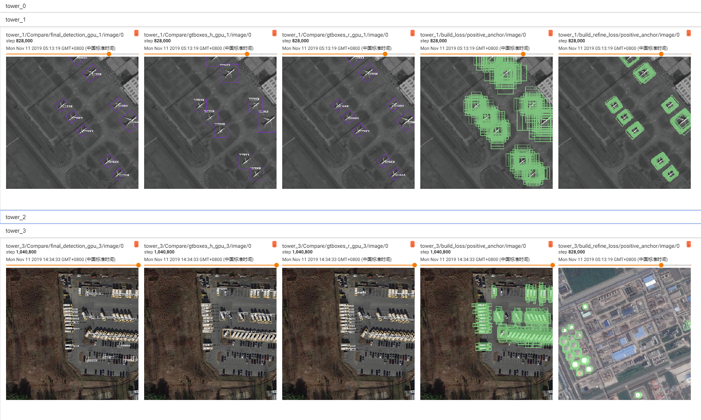
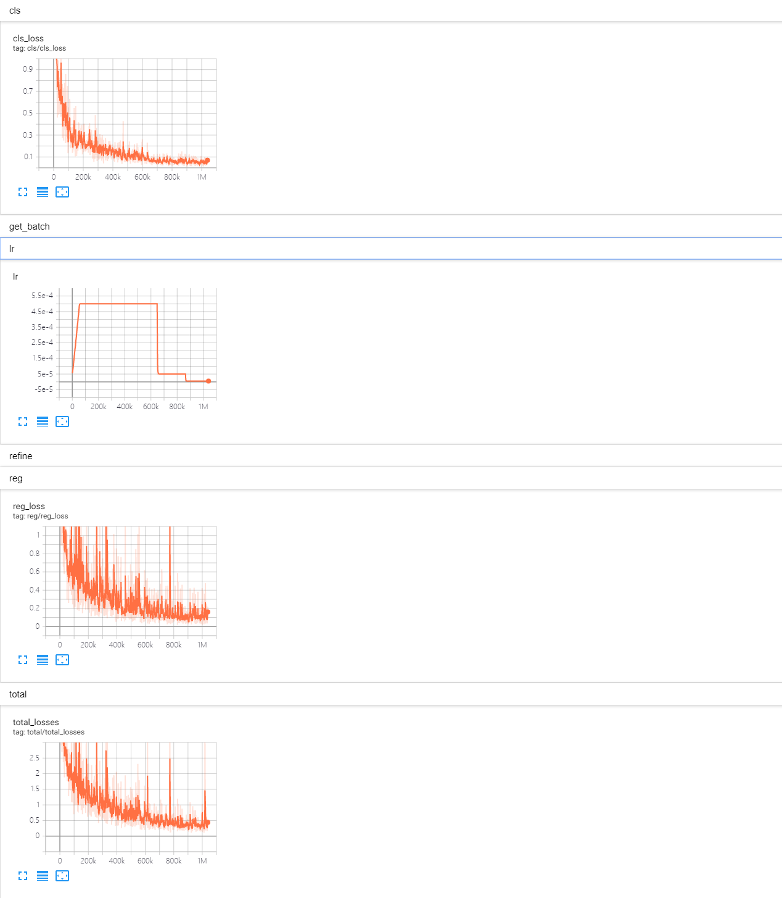

# ProbIoU on OBB detection

This work is a fork from [UranusDet](https://github.com/yangxue0827/RotationDetection) adapted to work with the ProbIoU loss from the paper
"Gaussian Bounding Boxes and Probabilistic Intersection-over-Union for Object Detection" (link TBD).

[](https://opensource.org/licenses/Apache-2.0)

## Development Environment
**docker images: yangxue2docker/yx-tf-det:tensorflow1.13.1-cuda10-gpu-py3 or yangxue2docker/py3-tf1.15.2-nv-torch1.8.0-cuda11:v1.0**        
1. python3.5 (anaconda recommend)               
2. cuda 10.0                     
3. opencv-python 4.1.1.26         
4. [tfplot 0.2.0](https://github.com/wookayin/tensorflow-plot) (optional)            
5. tensorflow-gpu 1.13
6. tqdm 4.54.0
7. Shapely 1.7.1

**Note: For 30xx series graphics cards, UranusDet authors recommend this [blog](https://blog.csdn.net/qq_39543404/article/details/112171851) to install tf1.xx, or refer to [ngc](https://ngc.nvidia.com/catalog/containers/nvidia:tensorflow) and [tensorflow-release-notes](https://docs.nvidia.com/deeplearning/frameworks/tensorflow-release-notes/rel_20-10.html#rel_20-10) to download docker image according to your environment, or just use my docker image (yangxue2docker/py3-tf1.15.2-nv-torch1.8.0-cuda11:v1.0)**

## Download Model
### Pretrain weights from UranusDet
Download a pretrain weight you need from the following three options, and then put it to $PATH_ROOT/dataloader/pretrained_weights. 
1. Tensorflow pretrain weights: [resnet50_v1](http://download.tensorflow.org/models/resnet_v1_50_2016_08_28.tar.gz), [resnet101_v1](http://download.tensorflow.org/models/resnet_v1_101_2016_08_28.tar.gz), [resnet152_v1](http://download.tensorflow.org/models/resnet_v1_152_2016_08_28.tar.gz), [efficientnet](https://github.com/tensorflow/tpu/tree/master/models/official/efficientnet), [mobilenet_v2](https://storage.googleapis.com/mobilenet_v2/checkpoints/mobilenet_v2_1.0_224.tgz), darknet53 ([Baidu Drive (1jg2)](https://pan.baidu.com/s/1p8V9aaivo9LNxa_OjXjUwA), [Google Drive](https://drive.google.com/drive/folders/1zyg1bvdmLxNRIXOflo_YmJjNJdpHX2lJ?usp=sharing)).      
2. MxNet pretrain weights **(Recommend in this repo)**: resnet_v1d, resnet_v1b, refer to [gluon2TF](./thirdparty/gluon2TF/README.md).    
* [Baidu Drive (5ht9)](https://pan.baidu.com/s/1GpqKg0dOaaWmwshvv1qWGg)          
* [Google Drive](https://drive.google.com/drive/folders/1BM8ffn1WnsRRb5RcuAcyJAHX8NS2M1Gz?usp=sharing)      
3. Pytorch pretrain weights, refer to [pretrain_zoo.py](./dataloader/pretrained_weights/pretrain_zoo.py) and [Others](./OTHERS.md).
* [Baidu Drive (oofm)](https://pan.baidu.com/s/16nHwlkPsszBvzhMv4h2IwA)          
* [Google Drive](https://drive.google.com/drive/folders/14Bx6TK4LVadTtzNFTQj293cKYk_5IurH?usp=sharing)      
### Pretrain weights for ProbIou
TBD...


### Trained weights
1. Please download trained models by this project, then put them to $PATH_ROOT/output/pretained_weights.

## Compile
    ```  
    cd $PATH_ROOT/libs/utils/cython_utils
    rm *.so
    rm *.c
    rm *.cpp
    python setup.py build_ext --inplace (or make)
    
    cd $PATH_ROOT/libs/utils/
    rm *.so
    rm *.c
    rm *.cpp
    python setup.py build_ext --inplace
    ```

## Train 

1. If you want to train your own dataset, please note:  
    ```
    (1) Select the detector and dataset you want to use, and mark them as #DETECTOR and #DATASET (such as #DETECTOR=retinanet and #DATASET=DOTA)
    (2) Modify parameters (such as CLASS_NUM, DATASET_NAME, VERSION, etc.) in $PATH_ROOT/libs/configs/#DATASET/#DETECTOR/cfgs_xxx.py
    (3) Copy $PATH_ROOT/libs/configs/#DATASET/#DETECTOR/cfgs_xxx.py to $PATH_ROOT/libs/configs/cfgs.py
    (4) Add category information in $PATH_ROOT/libs/label_name_dict/label_dict.py     
    (5) Add data_name to $PATH_ROOT/dataloader/dataset/read_tfrecord.py  
    ```     
	
1.1. To adjust the configs to train with ProbIoU:
	Select the config file under libs/configs/<DATASET> with probiou on its name.
	First replace all content of the config file under libs/configs/cfgs.py with the content of the file with _step1 for start training with ProbIoU 
	Wait for training end, then replace all content of the config file with the content of the file with _step2

2. Make tfrecord       
    If image is very large (such as DOTA dataset), the image needs to be cropped. Take DOTA dataset as a example:      
    ```  
    cd $PATH_ROOT/dataloader/dataset/DOTA
    python data_crop.py
    ```  
    For each dataset, you may need to do some data preparation. Just go to dataloader/dataset/<DATASET TO BE USED> and run the code inside it. 
	*Notice:* if the codes does not use parse arguments, you have to open it and change the parameters mannually on the code (usually at the end of the script).
	For example of annotation convertion to into xml format, refer to [example.xml](./example.xml).
    ```  
    cd $PATH_ROOT/dataloader/dataset/  
    python convert_data_to_tfrecord.py --VOC_dir='/PATH/TO/DOTA/' 
                                       --xml_dir='labeltxt'
                                       --image_dir='images'
                                       --save_name='train' 
                                       --img_format='.png' 
                                       --dataset='DOTA'
    ```      
    

3. Start training
    ```  
    cd $PATH_ROOT/tools/#DETECTOR
    python train.py
    ```

## Test
1. For large-scale image, take DOTA dataset as a example (the output file or visualization is in $PATH_ROOT/tools/#DETECTOR/test_dota/VERSION): 
    ```  
    cd $PATH_ROOT/tools/#DETECTOR
    python test_dota.py --test_dir='/PATH/TO/IMAGES/'  
                        --gpus=0,1,2,3,4,5,6,7  
                        -ms (multi-scale testing, optional)
                        -s (visualization, optional)
    ``` 

    **Notice: In order to set the breakpoint conveniently, the read and write mode of the file is' a+'. If the model of the same #VERSION needs to be tested again, the original test results need to be deleted.**

2. For small-scale image, take HRSC2016 dataset as a example: 
    ```  
    cd $PATH_ROOT/tools/#DETECTOR
    python test_hrsc2016.py --test_dir='/PATH/TO/IMAGES/'  
                            --gpu=0
                            --image_ext='bmp'
                            --test_annotation_path='/PATH/TO/ANNOTATIONS'
                            -s (visualization, optional)
    ``` 

## Tensorboard
```  
cd $PATH_ROOT/output/summary
tensorboard --logdir=.
``` 





## Results
TBD...

## Citation

TBD...

```

## Reference
1、https://github.com/endernewton/tf-faster-rcnn   
2、https://github.com/zengarden/light_head_rcnn   
3、https://github.com/tensorflow/models/tree/master/research/object_detection    
4、https://github.com/fizyr/keras-retinanet    
5.https://github.com/yangxue0827/RotationDetection 


