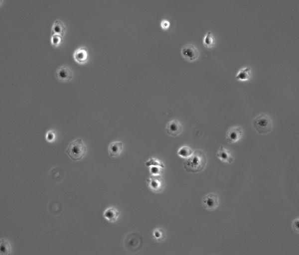
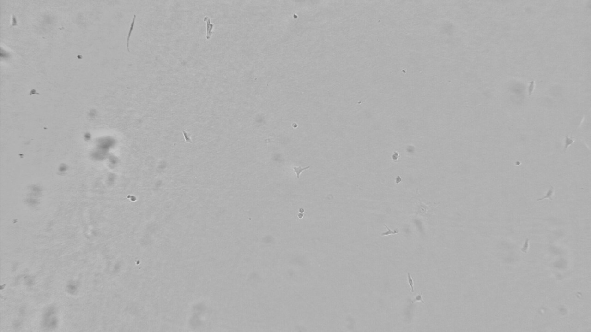

# Cell Tracking by detection

This repository contains the code for cell tracking by detection using OBB detections and a modified version of the Bise et al (Reliable Cell Tracking by Global Data Association) tracking algorithm.

## Topics

- [Getting started](#getting-started)
- [Running](#running)
- [Evaluation](#evaluation)
- [Example](#example)
- [(optional) OBB detection](#(optional)-obb-detection)

## Getting started

It is highly recommended that you use a virtual Python environment, such as [Anaconda](https://www.anaconda.com/products/distribution). After installing Anaconda, you can create a virtual environment running:
```
conda create -n cell_tracking python=3.6 pip
```

Then activate your environment using:
```
conda activate cell_tracking
```

And install the dependecies using:
```
pip install -r requirements.txt
```

Next, you have to set up your folder containing the images and detections. It is recommended to create the following folder structure for it:
```
frames
│
└───dataset1
│   │
│   └───frames
│       │   image1.png
│       │   image2.png
│       │   ...
│
│   └───detector1
│       │   det_mitoses.txt
│       │   det_normal.txt
│   └───detector1
│       │   det_mitoses.txt
│       │   det_normal.txt
│   
└───dataset2
    ...
```

This folder structure holds each dataset that you want to use the tracker. For each dataset, there is a folder containing the frame images and at least 
one folder containing the output detections from a OBB detector in a txt format. The detections should be splitted in two categories: ```normal``` cells and ```mitoses``` ones.
The detection file is comprised of the following columns for each prediction:
```
image_name score cx cy w h angle
```

For example:
```
img0061 0.999 115.0 71.5 35.0 34.0 -1.6
img0061 0.999 386.4 109.2 28.2 30.4 -73.5
img0061 0.998 133.6 97.5 35.0 33.1 -3.4
img0061 0.996 311.0 464.0 28.0 30.0 -90.0
img0101 0.167 105.5 288.3 37.3 26.3 -82.3
img0101 0.093 182.1 152.4 58.8 52.5 -48.4
img0101 0.051 268.0 489.0 26.2 24.1 -85.6
img0071 1.000 142.5 293.0 28.0 29.1 -85.9
img0071 0.999 343.0 271.0 22.8 22.8 -66.8
img0071 0.999 312.0 464.5 31.0 32.0 -90.0
...
```

## Running

For executing the tracking algorithm we provide an example pipeline code, ```main.py```. Please, refer to it to further instructions.

## Evaluation

You can evaluate the results with ground-truth labeled data. It should be in the csv format, or in a folder containing tif files. For further instructions, please
refer to the example pipeline code, and the documentation under ```tracker/eval.py```.

## Example

Below is an example of the code execution under a dataset of 109 images:


## (optional) OBB detection

For getting predicting OBB detections on your own dataset, we provide pre-trained weights on a Glioblastoma cell detection dataset (not public available yet):

| Model      | AP50 normal | AP50 mitoses | P50 normal | R50 normal | P50 mitoses | R50 mitoses |   AP50    |   AP75    |   AP50:95   |
|----------- | ----------- | ------------ | ---------- | ---------- | ----------- | ----------- |   -----   |   -----   |   -------   |
| RetinaNet  |   75.25     |   56.47      | 37.64      | 85.00      | 10.99       | 82.85       |   65.86   |   19.17   |   29.56     |
| R3Det      |   74.97     |   63.21      | 32.68      | 83.42      | 14.35       | 84.76       |   69.09   |   17.91   |   30.89     |
| R3Det DCL  |   75.50     |   62.63      | 31.58      | 83.54      | 15.75       | 84.76       |   69.06   | **20.57** |   30.73     |
| DCL        |   71.81     |   63.35      | 39.58      | 81.62      | 16.50       | 80.95       |   67.58   |   17.74   |   28.48     |
| CSL        |   72.42     |   53.98      | 35.20      | 84.10      | 10.94       | 84.76       |   63.20   |   18.59   |   27.00     |
| R2CNN      | **77.33**   | **69.65**    | **67.49**  | 82.41      | **52.79**   | 80.95       | **73.49** |   17.30   |   29.71     |
| Refine RetinaNet | 75.15 |   66.75      | 27.93      | **85.68**  | 11.94       | **89.52**   |   70.95   |   18.86   | **31.00**   |
| RSDet      |   74.33     |   63.60      | 38.65      | 83.31      | 9.63        | 87.62       |   68.97   |   16.15   |   29.86     |

You can run the models using the following command:
```
../bash make_prediction.sh
```

This bash script should be able to download the pre-trained weights and output the predictions for your own dataset (the path for the dataset will be asked during the code
execution and must be provided the complete path, i.e., relative paths will raise errors).
We do not guarantee good results when using datasets that are not from Glioblastoma cells.

Example of training data are displayed below:



